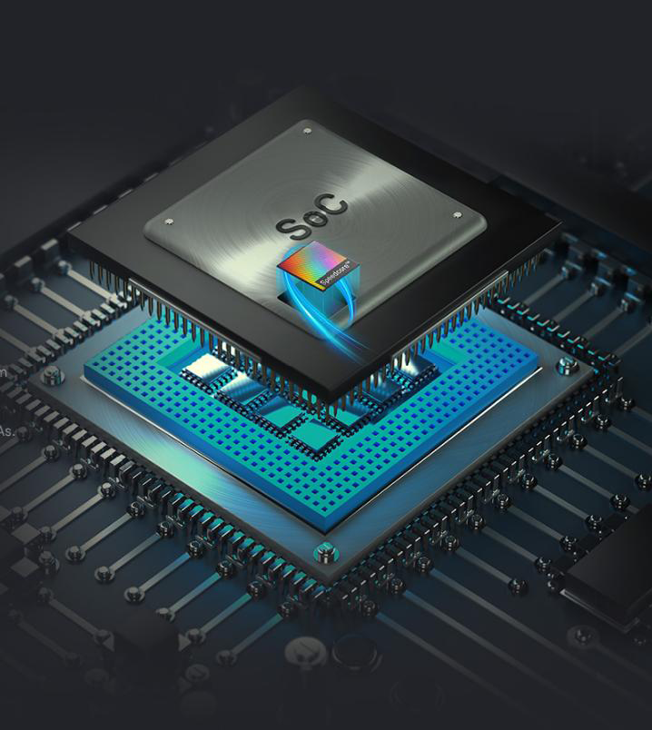
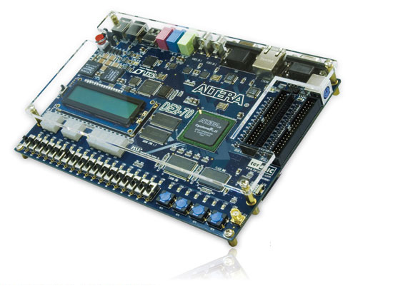
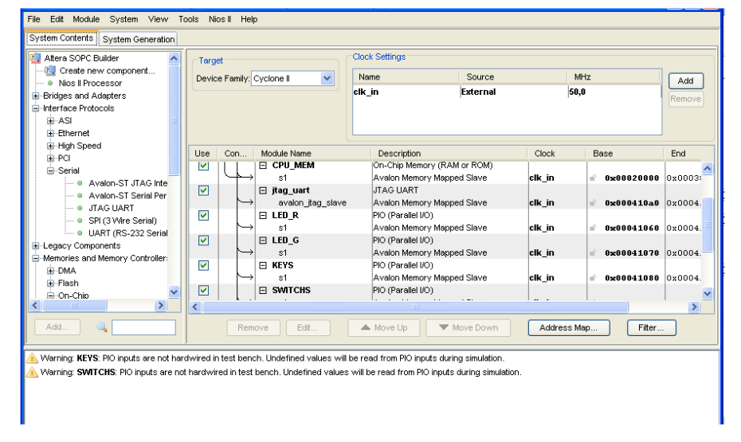
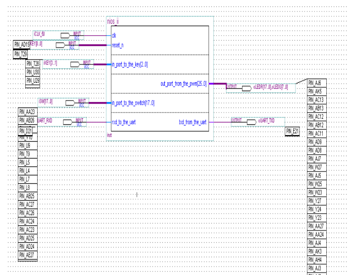
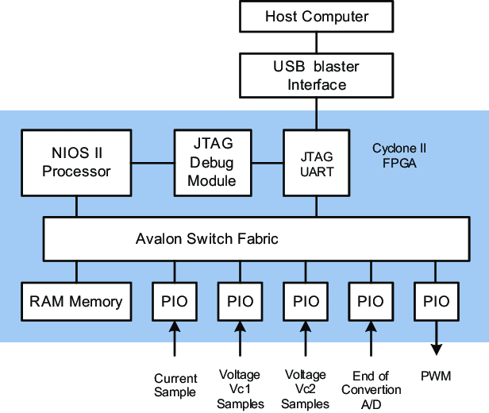
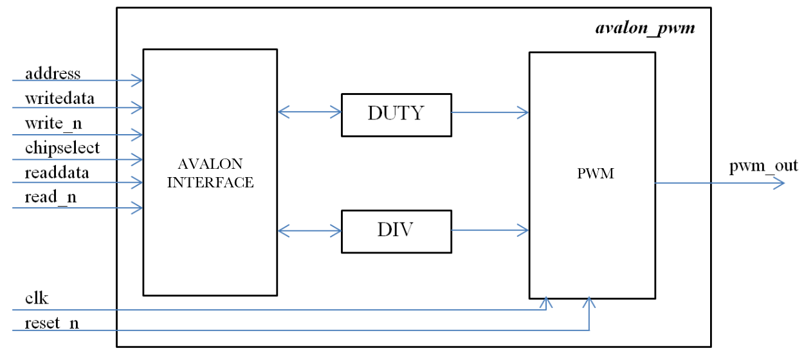

<!-- # Size Limit [![Cult Of Martians][cult-img]][cult] -->
<h1>System On Programmable Chip</h1>
<p align="center">
    
</p>

In this Mini-Project, I've tried to develop a mini **System On Chip**, developping both side(Hard + Soft), based on the open source, given processor in an **IP**(intellectual Property) Format, which is the **NIOS II** processor, by the company **Intel Altera**, using the **Quartus** Environment.


## HARD(SoPC)
### Board used :
 
* **Board used**: FPGA CYCLONE II DE2-70
<p align="center">
    
</p>

### Developping the Chip
To build the chip, I used the **SoPC Builder** tool of Quartus, It's an integrated tool, which allow us to add all the given component for free by Altera, in an IP Format(HDL Code Encrypted), also one of his big advantages, is that he can generate the HDL,ASM,C code for the created chip.
<p align="center">
  
</p>
We should add in the first place the main processor, which NIOS II, the CPU MEMORY, and the JTAG_UART component, as an essenital components for the chip, and then adding other component(Controllers), like Swicthes, Buttons, LCD, 7 Segments...etc. at the end we got the generated Chip below :

<p align="center">

</p>


 `PWM Output size 26`=> it's because on the FPGA Board, we have just 26 LEDs in total.

#### Altera Avalon Bus
The NIOS II processor, uses only one component(as an intermediate) to communicate with other controllers, existed inside the chip which is the AVALON Bus, It's an integrated Bus, from which all the data pass through it.
<p align="center">

</p>

### PWM Component
Inisde the SoPC Builder, Altera does not provide, an IP for PWM component(Controller + Interface), so that we can add it to our Chip, we have to develop our own VHDL code, and create a new component, in the file menu. the VHDL code contains 2 parts one for the **PWM logic**, and one for the **Interfacing**, since NIOS II, uses AVALON Bus as internal bus, from which the processor can `read/write` from/to other internal components.

<p align="center">

</p>

* **Address Signal**: To select which Register to use(Duty/Div), and since we got just 2 registers, this signal is coded on 1 bit(0/1). 
* **CS Signal**: Since all the compoenent are linked to the processor via this bus, we need to specify which chip we're dealing(write/read) with.
* **WriteDATA Signal**: For sending data over the bus.
* **Write_n Signal**: For Enabling/Disabling writing operation.
* **ReadDATA Signal**: For reading data from the bus.
* **Read_n  Signal**: For Enabling/Disabling Reading operation.
* **OutputPWM Signal**: Either 1 or 0 for all the other 25 bits, since the output signal is coded on 26 bits(26 LEDs).


## Soft

As a first step, we should develop the driver, to make it easy and simple manipulating the 2 registers (Duty && Div).
* **Driver:**
```yaml
#ifndef __ALTERA_AVALON_PWM_REGS_H__
#define __ALTERA_AVALON_PWM_REGS_H__

#include <io.h>

#define IORD_ALTERA_AVALON_PWM_DIVIDER(base)            IORD(base, 0) 
#define IOWR_ALTERA_AVALON_PWM_DIVIDER(base, data)      IOWR(base, 0, data)

#define IORD_ALTERA_AVALON_PWM_DUTY(base)       IORD(base, 1) 
#define IOWR_ALTERA_AVALON_PWM_DUTY(base, data) IOWR(base, 1, data)


#endif /* __ALTERA_AVALON_PWM_REGS_H__ */

```
* Simple application of the driver wlong with the PWM component

```yaml
#include "system.h" // where all the macros are defined(addresses of different components inside the chip)
#include "altera_avalon_pwm.h" //developed driver for pwm interfacing
#include "altera_avalon_pio_regs.h" //contains all the needed APIs for Reading and Writing
#include<stdio.h>

int main(){
    IOWR_ALTERA_AVALON_PWM_DIVIDER(PWM_BASE,0xFF); //PWM_BASE Contains the pwm component address
    IORD_ALTERA_AVALON_PWM_DUTY(PWM_BASE,0xFF);

    printf("Starting!!\n\n\n");
    while(1){
        for(int i=0x00;i<0xFF;i++){
            IORD_ALTERA_AVALON_PWM_DUTY(PWM_BASE,i); //changing the DUty cicyle => that will led to change the 26 LEDs intensity
        }
        IORD_ALTERA_AVALON_PWM_DUTY(PWM_BASE,0x00;
    }
}

```